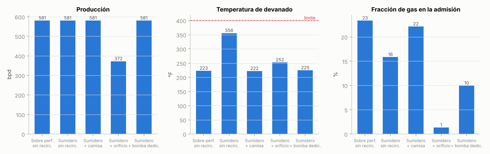
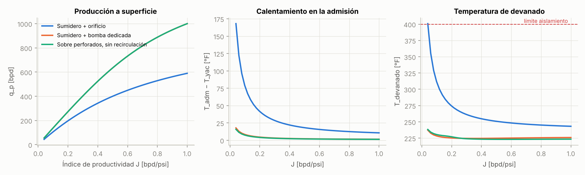
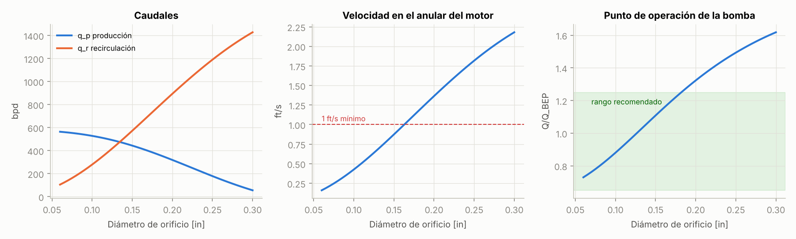
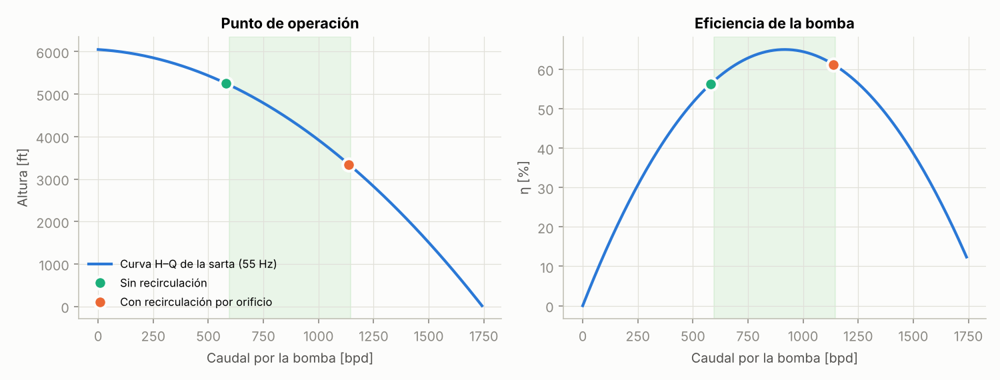
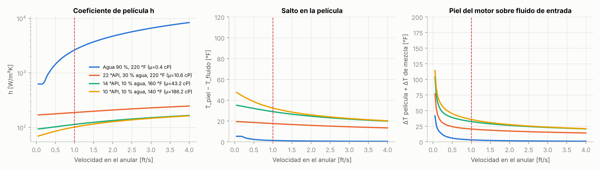

# Recirculación en pozos con bombeo electrosumergible (BES)

**Investigación técnica: fenómenos físicos, modelo matemático y simulación**

Este documento reúne la física y la matemática de los sistemas de recirculación usados en pozos petroleros con levantamiento artificial, con foco en el bombeo electrosumergible (BES/ESP). Todo lo que se presenta está implementado en dos modelos equivalentes:

| Archivo | Uso |
|---|---|
| [`simulador/index.html`](../simulador/index.html) | Simulador visual interactivo (abrir en el navegador) |
| [`simulador/modelo.js`](../simulador/modelo.js) | Modelo en JavaScript que usa el simulador |
| [`modelo/recirculacion.py`](../modelo/recirculacion.py) | El mismo modelo en Python, para cálculos e ingeniería |
| [`modelo/estudio_sensibilidad.py`](../modelo/estudio_sensibilidad.py) | Genera las figuras de este documento |
| [`herramientas/verificar_js_py.py`](../herramientas/verificar_js_py.py) | Comprueba que ambos modelos dan el mismo resultado |

---

## Índice

1. [Qué significa "recirculación" en un pozo](#1-qué-significa-recirculación-en-un-pozo)
2. [Por qué se necesita recircular](#2-por-qué-se-necesita-recircular)
3. [Configuraciones de equipo](#3-configuraciones-de-equipo)
4. [Hidráulica del sistema acoplado](#4-hidráulica-del-sistema-acoplado)
5. [Balance térmico del lazo de recirculación](#5-balance-térmico-del-lazo-de-recirculación)
6. [Transferencia de calor en el motor](#6-transferencia-de-calor-en-el-motor)
7. [Gas libre en la admisión](#7-gas-libre-en-la-admisión)
8. [Recirculación interna en las etapas de la bomba](#8-recirculación-interna-en-las-etapas-de-la-bomba)
9. [Otros fenómenos asociados](#9-otros-fenómenos-asociados)
10. [Resultados de simulación](#10-resultados-de-simulación)
11. [Procedimiento de diseño](#11-procedimiento-de-diseño)
12. [Limitaciones del modelo y calibración](#12-limitaciones-del-modelo-y-calibración)
13. [Referencias](#13-referencias)

### Nomenclatura

| Símbolo | Significado | Unidad SI | Unidad de campo |
|---|---|---|---|
| $q_p$ | caudal producido a superficie | m³/s | bpd |
| $q_r$ | caudal recirculado | m³/s | bpd |
| $Q_b$ | caudal que atraviesa la bomba principal | m³/s | bpd |
| $R = q_r/q_p$ | razón de recirculación | – | – |
| $H$ | altura (cabeza) de la bomba | m | ft |
| $\eta$ | eficiencia de la bomba | – | % |
| $P_{wf}, P_{adm}, P_{desc}$ | presión de fondo fluyente, de admisión, de descarga | Pa | psi |
| $\rho, c_p, \mu, k$ | densidad, calor específico, viscosidad, conductividad | kg/m³, J/kg·K, Pa·s, W/m·K | |
| $C = \rho c_p$ | capacidad calorífica volumétrica | J/m³·K | |
| $P_m, P_b, P_v, P_{br}$ | pérdidas del motor, de la bomba, de estrangulamiento y potencia de la bomba de recirculación | W | kW |
| $UA$ | conductancia térmica pozo–formación concentrada | W/K | |
| $v_m$ | velocidad del fluido en el anular del motor | m/s | ft/s |
| $h$ | coeficiente de película | W/m²·K | |
| GVF | fracción volumétrica de gas libre en la admisión | – | % |

Conversiones usadas: 1 bpd = 1.8401×10⁻⁶ m³/s; 1 psi = 6894.76 Pa; 1 ft = 0.3048 m; ΔT[°F] = 1.8·ΔT[K].

---

## 1. Qué significa "recirculación" en un pozo

En levantamiento artificial la palabra se usa para cuatro cosas distintas. Conviene separarlas porque obedecen a física diferente:

| Acepción | Dónde ocurre | Intencional | Objetivo o efecto |
|---|---|---|---|
| **Recirculación forzada para enfriar el motor** | Lazo bomba → línea → debajo del motor → admisión | Sí | Garantizar velocidad de fluido sobre el motor cuando el aporte no pasa por él o no alcanza |
| **Recirculación para mantener la bomba en rango** | Derivación de la descarga a la admisión | Sí | Que la bomba vea más caudal del que aporta el pozo y salga de la zona de empuje descendente |
| **Recirculación hidráulica interna** | Ojo y descarga del impulsor, a bajo caudal | No | Vórtices, vibración, erosión, calentamiento y empujes axiales anormales |
| **Recirculación en otros métodos** | Fluido motriz en bombeo hidráulico (jet, pistón), gas de inyección en gas lift de lazo cerrado | Sí | Reutilizar el fluido motriz o el gas; no se trata en detalle aquí |

Las dos primeras son el mismo equipo visto desde dos objetivos. La tercera aparece siempre que una bomba centrífuga trabaja muy por debajo de su punto de mejor eficiencia (BEP), y la recirculación forzada es precisamente una de las formas de evitarla.

---

## 2. Por qué se necesita recircular

Un motor BES es una máquina de inducción sellada, llena de aceite dieléctrico, que **no tiene otro medio de refrigeración que el fluido del pozo que pasa por su carcasa**. Del 10 al 20 % de la potencia que consume se convierte en calor dentro del motor. Si el fluido no lo barre con suficiente velocidad, el devanado se calienta, el aislamiento envejece de forma exponencial y el motor falla.

El criterio de diseño histórico de la industria es una velocidad mínima de **1 ft/s (0.3048 m/s)** en el anular entre el motor y el revestimiento (o la camisa). Estudios más recientes de transferencia de calor muestran que con crudos viscosos ese valor es insuficiente y recomiendan del orden de 2.6 a 2.8 ft/s (0.8 a 0.85 m/s) ([Missouri S&T, estudio paramétrico motor/camisa](https://scholarsmine.mst.edu/mec_aereng_facwork/1770)). La sección 6 explica por qué.

Las situaciones típicas en que el aporte natural no refrigera el motor son:

1. **Equipo bajo los perforados (en el sumidero o *rat hole*).** Se hace para ganar sumergencia, bajar la presión de fondo y, sobre todo, para **separar el gas de forma natural**: el líquido baja hacia la admisión y las burbujas suben por el anular. El costo es que el fluido entra a la bomba por encima del motor y **nunca pasa por él**.
2. **Pozos de bajo aporte.** El caudal del yacimiento dividido por el área anular da menos de 1 ft/s, aun con el equipo sobre los perforados.
3. **Revestimientos grandes con motores pequeños.** El área anular es grande y la velocidad cae.
4. **Pozos desviados u horizontales** con el equipo en la curva o con perforados por encima.
5. **Crudo pesado**, donde el coeficiente de película es bajo y se necesita más velocidad.
6. **Bomba sobredimensionada** respecto al aporte: la bomba opera en empuje descendente; recircular parte de la descarga aumenta el caudal que la atraviesa.

---

## 3. Configuraciones de equipo

```
   (a) Convencional        (b) Sumidero          (c) Camisa             (d) Sumidero +
   sobre perforados        sin refrigeración     (shroud)               recirculación
        │ │                    │ │                  │ │                    │ │
       [BOMBA]             ═══ perforados ═══   ═══ perforados ═══   ═══ perforados ═══
       [ADMIS] ← fluido        ↓  ↓                 ↓  ↓                 ↓  ↓
       [SELLO]  sube           [BOMBA]            ┌[BOMBA]┐              [BOMBA]──┐
       [MOTOR]  ↑ ↑            [ADMIS] ← baja     │[ADMIS]│ ← sube       [ADMIS]  │ línea
        ↑   ↑                  [SELLO]            │[SELLO]│   por        [SELLO]  │ de
   ═══ perforados ═══          [MOTOR] fluido     │[MOTOR]│   dentro     [MOTOR]  │ recirc.
                               estancado          └───────┘ ↑ baja        ↑ ↑ ←───┘
                                                   por fuera              salida bajo el motor
```

| Configuración | Flujo por el motor | Separación natural de gas | Ventajas | Desventajas |
|---|---|---|---|---|
| (a) Sobre perforados | $q_p$ | Baja | Simple; el motor se refrigera con fluido fresco | Poca sumergencia; el gas entra con el líquido |
| (b) Sumidero sin refrigeración | ≈ 0 (solo convección natural) | Alta | Máximo abatimiento y separación de gas | El motor se sobrecalienta; no recomendable |
| (c) Camisa (shroud) | $q_p$, con área reducida | Media | Velocidad alta en el motor sin equipo extra | Requiere holgura radial; la camisa puede atrapar gas y sólidos; restringe diámetros |
| (d-1) Recirculación por derivación (orificio) | $q_r$ | Alta | Además pone la bomba en rango | Desperdicia altura de la bomba; reduce producción; calienta el lazo; erosión del orificio |
| (d-2) Bomba de recirculación dedicada | $q_r$ | Alta | Recircula con muy poca potencia | Más equipo en el pozo; la bomba principal sigue viendo solo $q_p$ |

En la variante **por derivación**, un puerto en la cabeza de descarga (o una herramienta en Y) envía una fracción del caudal bombeado por una línea delgada que baja por fuera de la bomba, del sello y del motor, y descarga por debajo del motor. Un orificio en la línea fija cuánto se recircula. En la variante **dedicada**, unas pocas etapas independientes, accionadas por el mismo eje, toman fluido en la admisión y lo empujan por la línea. Patentes como la [US 5,845,709 (bomba de recirculación para sistemas BES)](https://patents.google.com/patent/US5845709) y la [US 7,841,395 (BES con capacidad de recirculación)](https://image-ppubs.uspto.gov/dirsearch-public/print/downloadPdf/7841395) describen ambas arquitecturas. Una evaluación de campo reciente en pozos multizona del Permian comparó camisas y sistemas de recirculación y encontró mejor confiabilidad en la recirculación ([SWPSC 2026-009](https://www.swpshortcourse.org/conference/2026-swpsc/abstract/2026009-field-evaluation-esp-motor-cooling-technologies-deployed)).

---

## 4. Hidráulica del sistema acoplado

### 4.1 Aporte del yacimiento (IPR)

Por encima de la presión de burbuja se usa índice de productividad lineal; por debajo, la ecuación de Vogel (IPR compuesta):

$$
q(P_{wf}) =
\begin{cases}
J\,(P_r - P_{wf}) & P_{wf} \ge P_b \\[4pt]
q_b + \dfrac{J P_b}{1.8}\left[1 - 0.2\dfrac{P_{wf}}{P_b} - 0.8\left(\dfrac{P_{wf}}{P_b}\right)^2\right] & P_{wf} < P_b
\end{cases}
\qquad q_b = J(P_r - P_b)
$$

La presión de burbuja sale de la correlación de Standing con la RGA del yacimiento:

$$
P_b = 18.2\left[\left(\frac{R_s}{\gamma_g}\right)^{0.83} 10^{\,0.00091\,T - 0.0125\,\text{API}} - 1.4\right]
$$

### 4.2 Presión en la admisión y en la descarga

Con la admisión a una distancia vertical $\Delta z = D_{bomba} - D_{perf}$ (positiva si está por debajo de los perforados):

$$
P_{adm}(q_p) = P_{wf}(q_p) + \rho g\,\Delta z
$$

En la descarga, la bomba debe sostener la columna en la tubería de producción más la fricción y la presión en cabeza. **Por la tubería solo sube $q_p$**, nunca la recirculación:

$$
P_{desc}(q_p) = P_{wh} + \rho g\,D_{bomba} + \Delta P_f^{tbg}(q_p),\qquad
\Delta P_f = f\,\frac{L}{D}\,\frac{\rho v^2}{2}
$$

con el factor de Darcy de Swamee–Jain en turbulento y $64/Re$ en laminar.

### 4.3 Curva de la bomba

El modelo usa una etapa genérica normalizada con $x = Q/Q_{BEP}$:

$$
\frac{H}{H_0} = h(x) = 1 - 0.05\,x - 0.25\,x^2,\qquad
\eta(x) = \eta_{BEP}\,x\,(2 - x)
$$

Así $h(1) = 0.70$ (el BEP está al 70 % de la altura de cierre), la altura se anula cerca de $x = 1.9$ y la eficiencia es máxima en el BEP. Con esta forma la potencia al eje queda finita a caudal cero:

$$
P_{eje} = \frac{\rho g Q H}{\eta} = \frac{\rho g\,H_0\,h(x)\,Q_{BEP}}{\eta_{BEP}\,(2 - x)}
\quad\Rightarrow\quad
\frac{P_{eje}(0)}{P_{eje}(1)} = \frac{0.5}{0.7} \approx 0.71
$$

La frecuencia del variador escala la curva por las **leyes de afinidad**: $Q \propto f$, $H \propto f^2$, $P \propto f^3$. Para $N$ etapas: $H_{sarta} = N\,H_{etapa}$.

### 4.4 Línea de recirculación

La línea baja desde la descarga hasta debajo del motor y descarga en el anular, que está a la presión de admisión más la columna correspondiente. **La columna hidrostática dentro de la línea se cancela con la del anular**, de modo que la presión disponible para mover el fluido por la línea es la que entrega la bomba:

$$
\rho g\,H_{bomba}(Q_b) = \underbrace{\frac{\rho}{2}\left(\frac{q_r}{C_d A_o}\right)^2}_{\text{orificio}} + \underbrace{\left(f\frac{L_r}{D_r} + \sum K\right)\frac{\rho v_r^2}{2}}_{\text{línea}}
$$

Con bomba dedicada, el lado izquierdo es la altura de esa bomba evaluada en $q_r$.

### 4.5 Sistema de ecuaciones y solución

**Derivación por orificio.** La bomba principal maneja $Q_b = q_p + q_r$. Las incógnitas son $q_p$ y $q_r$:

$$
\begin{aligned}
\text{(1)}\quad & \rho g\,H(q_p + q_r) = P_{desc}(q_p) - P_{adm}(q_p) \\
\text{(2)}\quad & \rho g\,H(q_p + q_r) = \Delta P_{or}(q_r) + \Delta P_{línea}(q_r)
\end{aligned}
$$

**Bomba dedicada.** Las ecuaciones se desacoplan: $Q_b = q_p$, la ecuación (1) da $q_p$ y $q_r$ sale de la curva de la bomba de recirculación contra la línea.

La solución es única porque todas las funciones son monótonas: $H$ decrece con $Q$; $\Delta P_{or} + \Delta P_{línea}$ crece con $q_r$; $P_{desc} - P_{adm}$ crece con $q_p$ (más fricción y menor $P_{wf}$). El simulador resuelve con **bisección anidada**: para cada $q_p$ de prueba resuelve (2) para $q_r$, y una bisección externa busca el $q_p$ que cumple (1). Como las propiedades del fluido dependen de la temperatura y la temperatura depende del caudal, hay un tercer lazo de punto fijo sobre la temperatura de admisión (converge en 3 a 6 iteraciones).

Aparecen tres regímenes:

| Régimen | Condición | Significado físico |
|---|---|---|
| Normal | la ecuación (1) tiene raíz con $P_{adm} > P_{min}$ | Operación estable |
| *Pump-off* | aun con $P_{adm} = P_{min}$ la bomba podría mover más | El pozo no aporta lo que la bomba maneja; nivel en la admisión, ingreso de gas o vapor, ciclos de paro |
| Sin producción | $H(Q_b)$ no alcanza la columna ni con $q_p = 0$ | Con orificio, **todo el caudal recircula**: el lazo se calienta sin límite salvo por las pérdidas a la formación |

> **Resultado clave de la hidráulica.** Con derivación por orificio, la recirculación **consume capacidad de la bomba**. Al recircular, el caudal por la bomba sube, la altura por etapa baja y la bomba ya no vence la misma columna con el mismo $q_p$. En el caso base la producción cae de 581 a 372 bpd (−36 %) al abrir un orificio de 0.18 in (figura 2). La bomba dedicada no tiene ese costo.

---

## 5. Balance térmico del lazo de recirculación

### 5.1 Fuentes de calor

| Fuente | Expresión | Comentario |
|---|---|---|
| Motor | $P_m = P_{m,nom}\,[k_0 + (1 - k_0)\,L^2]$, con $P_{m,nom} = P_{nom}(1/\eta_m - 1)$ | $k_0$: pérdidas fijas (hierro, fricción); $L^2$: pérdidas en el cobre ∝ corriente² |
| Bomba principal | $P_b = P_{eje} - \rho g H Q_b$ | La potencia que no se convierte en altura se disipa en el fluido |
| Estrangulamiento | $P_v = \Delta P_{rec}\,q_r = \rho g H q_r$ | **Toda** la altura entregada al fluido recirculado se pierde en el orificio y la línea, y vuelve como calor |
| Bomba dedicada | $P_{br} = P_{eje,r}$ | Toda su potencia termina como calor del lazo |

Calentamiento de un fluido al atravesar la bomba (útil como regla rápida):

$$
\Delta T_{bomba} = \frac{P_b}{\rho c_p Q_b} = \frac{g H\,(1 - \eta)}{\eta\,c_p}
$$

Para 3 344 ft (1 019 m) de altura, η = 61 % y $c_p$ = 3 500 J/kg·K: $\Delta T \approx 1.8$ K ≈ 3.2 °F. A caudales muy bajos η cae y el calentamiento por pasada crece mucho (sección 8).

### 5.2 Ecuaciones de nodo

Se toma una temperatura por nodo: yacimiento $T_y$, mezcla bajo el motor $T_1$, admisión $T_{adm}$, descarga $T_d$, salida de la línea $T_r$. Con derivación por orificio y equipo sobre los perforados:

$$
\begin{aligned}
C\,Q_b\,T_1 &= C\,q_p\,T_y + C\,q_r\,T_r && \text{(mezcla bajo el motor)}\\
T_{adm} &= T_1 + \frac{P_m}{C Q_b} - \frac{UA\,(T_{adm} - T_y)}{C Q_b} && \text{(paso por el motor y pérdida al pozo)}\\
T_d &= T_{adm} + \frac{P_b}{C Q_b} && \text{(bomba)}\\
T_r &= T_d + \frac{P_v}{C q_r} && \text{(orificio y línea)}
\end{aligned}
$$

Eliminando $T_1$, $T_d$ y $T_r$ queda una expresión cerrada. Lo notable es que **la misma expresión vale para las tres posiciones del equipo y para los dos tipos de recirculación**:

$$
\boxed{\;T_{adm} - T_y = \frac{r\,P_b + P_v + P_m + P_{br}}{C\,q_p + UA}\;}
\qquad r = \begin{cases} q_r/Q_b & \text{orificio}\\ 0 & \text{dedicada o sin recirculación}\end{cases}
$$

### 5.3 Consecuencias

**(i) La recirculación no evacua calor, solo lo redistribuye.** Con $UA = 0$, la temperatura en la tubería de producción es

$$
T_d - T_y = \frac{P_b + P_v + P_m + P_{br}}{C\,q_p}
$$

Todo el calor generado sale con la producción. El denominador es $q_p$, no $q_p + q_r$.

**(ii) El calentamiento diverge cuando la producción tiende a cero.** Solo lo limita la conducción a la formación ($UA$). Con orificio y $J = 0.05$ bpd/psi, la producción cae a 54 bpd y la admisión sube 141 °F sobre el yacimiento; con $UA = 0$ subiría 180 °F y el devanado pasaría el límite (figura 1). Esta es la **fuga térmica** típica de un pozo que deja de aportar mientras la recirculación sigue funcionando.

**(iii) La recirculación por orificio cuesta calor, además de producción.** El término $P_v$ es la potencia hidráulica que la bomba invierte en el fluido recirculado. En el caso base son 14.2 kW, más que las pérdidas de la propia bomba (13.4 kW) y casi tres veces las del motor (5.2 kW). La bomba dedicada recircula más caudal con 0.5 kW.

**(iv) En el sumidero el motor se refrigera con el fluido más caliente del lazo.** La admisión queda igual que en (5.2), pero el fluido que sube por el motor es el de la línea, que ya pasó por la bomba y el orificio:

$$
T_{motor,ent} = T_r,\qquad T_{motor,sal} = T_r + \frac{P_m}{C\,q_r}
$$

Sobre los perforados, en cambio, el motor recibe la mezcla más fría del lazo. Con orificio en el sumidero, el fluido llega al motor a 228 °F cuando el yacimiento está a 200 °F.

**(v) La razón de recirculación amplifica el calor de la bomba.** El calor de bomba que entra a la admisión es $r P_b = \frac{R}{1+R} P_b$; con $R \gg 1$ prácticamente todo el calor de la bomba vuelve a la admisión.

### 5.4 Dinámica

El simulador usa dos constantes de tiempo de primer orden:

$$
\tau_{motor} = \frac{M_{motor}\,c_{acero}}{h\,A_{motor}},\qquad
\tau_{pozo} = \frac{C\,V_{pozo} + C_{acero}}{C\,q_p + UA}
$$

Con ~15 kg/hp de masa de motor, $\tau_{motor}$ va de unos minutos (agua, flujo turbulento) a horas (crudo viscoso en laminar). La temperatura de la admisión responde en una o dos horas. El botón *Arranque en frío* del simulador muestra el calentamiento desde la temperatura del yacimiento.

---

## 6. Transferencia de calor en el motor

### 6.1 Geometría del anular

$$
A_{an} = \frac{\pi}{4}\left(D_{ext}^2 - D_m^2\right),\qquad
D_h = D_{ext} - D_m,\qquad
v_m = \frac{Q_{motor}}{A_{an}}
$$

$D_{ext}$ es el diámetro interno del revestimiento o de la camisa. Para un motor serie 562 (5.62 in) en revestimiento de 7 in, 26 lb/ft (ID 6.276 in): $A_{an} = 6.13$ in², $D_h = 0.656$ in, y **1 ft/s exige 655 bpd** pasando por el motor.

### 6.2 Coeficiente de película

Con $Re = \rho v_m D_h/\mu$ y $Pr = \mu c_p/k$:

- **Turbulento** ($Re > 4000$), Gnielinski:

$$
Nu = \frac{(f/8)\,(Re - 1000)\,Pr}{1 + 12.7\sqrt{f/8}\,\left(Pr^{2/3} - 1\right)},\qquad f = (0.79\ln Re - 1.64)^{-2}
$$

- **Laminar** ($Re < 2300$), Hausen (entrada térmica):

$$
Nu = 3.66 + \frac{0.0668\,Gz}{1 + 0.04\,Gz^{2/3}},\qquad Gz = \frac{D_h\,Re\,Pr}{L_m}
$$

- **Transición:** interpolación lineal entre ambos.
- **Convección natural** turbulenta sobre la carcasa: $Nu_L = 0.15\,Ra^{1/3}$, que da un $h_n$ independiente de la longitud:

$$
h_n = 0.15\,k\left(\frac{g\,\beta\,\Delta T}{\nu\,\alpha}\right)^{1/3}
$$

- **Combinación** de forzada y natural: $h = \left(h_f^3 + h_n^3\right)^{1/3}$, resuelta por punto fijo sobre $\Delta T$.

### 6.3 Temperatura de carcasa y de devanado

$$
q'' = \frac{P_m}{\pi D_m L_m},\qquad
T_{piel} = T_{fluido,sal} + \frac{q''}{h},\qquad
T_{dev} = T_{piel} + \Delta T_{int}\,\frac{P_m}{P_{m,nom}}
$$

$\Delta T_{int}$ es el salto interno (aceite del motor, entrehierro, aislamiento) a pérdidas nominales; en el modelo es un parámetro calibrable de 40 °F.

### 6.4 Por qué el crudo pesado necesita más de 1 ft/s

La figura 4 muestra $h$ para cuatro fluidos. Con agua, 1 ft/s ya es turbulento ($Re \approx 10^4$) y $h$ supera 2 000 W/m²K: el salto de película es de 1 a 2 °F. Con crudo de 10 a 14 °API a 140 a 160 °F (μ de 40 a 190 cP), el flujo es laminar a cualquier velocidad práctica, $h$ cae a ~100 W/m²K y el salto de película a 1 ft/s es de unos 30 °F. En laminar, $h$ crece solo con $Gz^{1/3}$, así que duplicar la velocidad apenas lo mejora. Lo que sí baja con la velocidad es el calentamiento del fluido a lo largo del motor ($P_m/C Q_{motor}$), que en crudo es mayor porque $c_p$ del crudo es la mitad del del agua. Por eso los estudios para crudo pesado recomiendan del orden de 2.6 a 2.8 ft/s.

### 6.5 Vida del aislamiento

Se usa la regla de Montsinger: la vida del aislamiento se reduce a la mitad por cada 10 °C (18 °F) de aumento de temperatura:

$$
\frac{\text{Vida}}{\text{Vida}_{lím}} = 2^{(T_{lím} - T_{dev})/10\,°\text{C}}
$$

Pasar de 223 °F (equipo convencional) a 356 °F de devanado (sumidero sin refrigeración) reduce la vida esperada unas 165 veces.

---

## 7. Gas libre en la admisión

### 7.1 Gas libre a condiciones de admisión

Con Standing para la solubilidad y gas real con $z$ constante:

$$
R_s = \gamma_g\left[\left(\frac{P}{18.2} + 1.4\right)10^{\,0.0125\,\text{API} - 0.00091\,T}\right]^{1.2048},\qquad
B_g = 0.00504\,\frac{z\,T_R}{P}\ \text{[bbl/scf]}
$$

$$
q_g = q_o\,(RGA - R_s)\,B_g
$$

**La recirculación calienta la admisión, y al subir la temperatura baja $R_s$: hay más gas libre.** Es un efecto secundario pero en el sentido desfavorable.

### 7.2 Separación natural

Las burbujas suben a una velocidad terminal $v_b$ (del orden de 0.5 ft/s en el régimen de burbuja de Harmathy) relativa al líquido. La fracción que no entra a la bomba se estima como

$$
E = \frac{v_b}{v_b + v_l}
$$

donde $v_l$ es la velocidad del líquido que la burbuja debe vencer: el líquido que sube hacia la admisión (sobre perforados) o el que baja hacia ella (sumidero, o por fuera de la camisa). Es una simplificación; modelos como los de Alhanati o Marquez incluyen la geometría de la admisión.

### 7.3 Dilución por el líquido recirculado

El fluido recirculado vuelve a la admisión con gas que fue comprimido y en parte redisuelto en la bomba. Si una fracción $\varphi$ de ese gas se vuelve a liberar al bajar la presión:

$$
GVF = \frac{q_g(1 - E)(1 + \varphi R)}{q_g(1 - E)(1 + \varphi R) + q_L + q_r}
$$

- Con $\varphi = 1$ (equilibrio instantáneo) la composición del lazo es la del yacimiento y la recirculación **no** diluye el gas.
- Con $\varphi = 0$ (gas redisuelto que no se libera durante el tránsito) el GVF baja aproximadamente como $1/(1 + R)$.

La realidad está en medio y depende de la cinética de liberación, el tiempo de residencia y si hay separador de gas. El simulador toma $\varphi = 0.3$ por defecto. Con orificio aparece además un efecto indirecto fuerte: como la producción cae, $P_{adm}$ sube (de 568 a 1 403 psi en el caso base) y hay mucho menos gas libre.

Valores de referencia del GVF que toleran las etapas, según el tipo de etapa: radiales del orden de 10 %, flujo mixto del orden de 20 a 25 %, etapas manejadoras de gas y helicoaxiales bastante más. Los límites reales dependen del fabricante y de la presión de admisión.

---

## 8. Recirculación interna en las etapas de la bomba

### 8.1 El fenómeno

Cuando una bomba centrífuga trabaja muy por debajo del BEP, los ángulos de entrada del flujo ya no coinciden con los álabes. Se desprende el flujo y aparecen vórtices que **regresan fluido desde el impulsor hacia la succión** (recirculación de succión) y **desde la difusora hacia el impulsor** (recirculación de descarga). Fraser documentó el inicio de estos regímenes en bombas de una y varias etapas y lo relacionó con la velocidad específica de succión ([Pumps & Systems, parámetros de succión](https://pumpsandsystems.com/suction-parameters-relating-npsh-issues)).

$$
N_s = \frac{N\sqrt{Q_{BEP}}}{H_{BEP}^{3/4}},\qquad
N_{ss} = \frac{N\sqrt{Q_{BEP}}}{NPSH_r^{3/4}}
$$

Cuanto mayor es $N_{ss}$ (ojo de impulsor grande, diseñado para NPSH bajo), más cerca del BEP empieza la recirculación de succión. Como orden de magnitud, la recirculación crece rápidamente por debajo del 50 a 60 % del BEP.

### 8.2 Consecuencias

| Efecto | Mecanismo |
|---|---|
| Calentamiento | La energía de los vórtices se disipa; η cae y $\Delta T = gH(1 - \eta)/(\eta c_p)$ crece |
| Daño tipo cavitación | Los vórtices de recirculación tienen núcleos de baja presión que implosionan en el lado de presión de los álabes, aun con NPSH disponible suficiente |
| Vibración y pulsaciones | Flujo inestable de baja frecuencia |
| Empuje descendente (*downthrust*) | En BES, por debajo del rango recomendado el impulsor flotante se apoya sobre las arandelas inferiores; desgaste de arandelas y difusores |
| Empuje ascendente (*upthrust*) | Por encima del rango: el impulsor sube; desgaste de arandelas superiores |

### 8.3 Relación con la recirculación forzada

La derivación por orificio es una forma de **mover el punto de operación hacia el BEP** cuando el pozo no aporta lo suficiente. En el caso base la bomba pasa de 0.63×BEP (empuje descendente, η = 56 %) a 1.24×BEP (dentro del rango, η = 61 %) (figura 3). La bomba dedicada no ayuda en esto: la bomba principal sigue en 0.63×BEP. En el caso de bajo aporte ($J$ = 0.1) con bomba dedicada, la principal queda en 0.15×BEP: profundamente en recirculación interna, con 41 °F de calentamiento por pasada. Ese calor sale por la tubería y no afecta al motor, pero sí afecta a la bomba.

---

## 9. Otros fenómenos asociados

| Fenómeno | Relación con la recirculación | Cómo estimarlo |
|---|---|---|
| **Erosión del orificio** | La velocidad en el orificio es enorme: 462 ft/s en el caso base (ΔP = 1 465 psi) | Comparar con la velocidad erosional de API RP 14E, $V_e = C/\sqrt{\rho}$ con C = 100 y ρ en lb/ft³ (~13 ft/s). Con arena, el orificio se agranda, la recirculación aumenta y la producción cae |
| **Desgaste abrasivo de la bomba** | En estado estacionario la concentración de sólidos en el lazo es la del yacimiento, pero el caudal por la bomba es $Q_b$ | Desgaste relativo ∝ $Q_b/q_p = 1 + R$ (orificio) |
| **Incrustaciones** | El carbonato de calcio tiene solubilidad inversa con la temperatura; el calentamiento del lazo y del motor favorece la precipitación sobre la carcasa | Índice de saturación (Langelier o Stiff–Davis) a la temperatura de piel del motor, no a la del yacimiento |
| **Emulsiones** | El estrangulamiento en el orificio es una zona de alto esfuerzo cortante que emulsiona; la viscosidad aparente puede subir | Modelo de Brinkman $\mu = \mu_c(1 - \phi_d)^{-2.5}$ con punto de inversión |
| **Viscosidad** | El calentamiento baja la viscosidad del crudo; en crudo pesado esto es parcialmente favorable | Beggs–Robinson con la temperatura del lazo |
| **Parafinas y asfaltenos** | El calentamiento ayuda contra parafinas en el fondo; los cambios de presión y temperatura pueden desestabilizar asfaltenos | Envolventes de precipitación del fluido |
| **Corrosión** | La velocidad de corrosión aumenta con la temperatura y la velocidad (CO₂, H₂S) | Modelos tipo de Waard–Milliams en la línea de recirculación |
| **Carga eléctrica** | La recirculación por orificio aumenta la potencia al eje; la dedicada casi no | Carga del motor $L$ y amperaje |

---

## 10. Resultados de simulación

Caso base (parámetros por defecto del simulador): perforados a 6 000 ft, presión de yacimiento 2 200 psi, $J$ = 0.45 bpd/psi, 200 °F, RGA 250 scf/stb, 22 °API, 70 % de agua; revestimiento de 7 in, motor serie 562 de 90 hp y 20 ft; bomba de 180 etapas con BEP de 1 000 bpd a 60 Hz operando a 55 Hz; equipo 200 ft bajo los perforados.

### 10.1 Comparación de configuraciones



| Configuración | $q_p$ [bpd] | $q_r$ [bpd] | $v_m$ [ft/s] | $T_{adm}$ [°F] | $T_{dev}$ [°F] | GVF [%] | $Q_b/Q_{BEP}$ |
|---|---:|---:|---:|---:|---:|---:|---:|
| Sobre perforados, sin recirculación | 581 | 0 | 0.89 | 202 | 223 | 23.4 | 0.63 |
| Sumidero sin recirculación | 581 | 0 | 0.00 | 202 | **356** | 15.8 | 0.63 |
| Camisa, motor 456 (30 ft) | 581 | 0 | 0.71 | 202 | 223 | 19.4 | 0.63 |
| Sumidero + orificio 0.18 in | **372** | 766 | 1.17 | 220 | 253 | 1.3 | 1.24 |
| Sumidero + bomba dedicada (3 etapas) | 581 | 833 | 1.27 | 202 | **225** | 10.0 | 0.63 |

Lectura:

- En el sumidero sin refrigeración el devanado sube 133 °F respecto a la opción convencional.
- La recirculación por orificio refrigera el motor y pone la bomba en rango, pero pierde un 36 % de producción, calienta la admisión 18 °F y destruye 14 kW en el orificio.
- La bomba dedicada consigue el mejor compromiso: refrigera igual o mejor, no pierde producción y gasta 0.5 kW. A cambio, la bomba principal queda en empuje descendente: habría que redimensionarla (menos etapas o menor BEP) o bajar la frecuencia.

### 10.2 Efecto del aporte del yacimiento



Con orificio, el calentamiento de la admisión crece como $1/q_p$ al caer el aporte, como predice la ecuación del balance. Con bomba dedicada el calor recirculado es tan pequeño que el efecto casi desaparece. Por eso, en un pozo con aporte declinante, un sistema por orificio diseñado para el aporte inicial puede terminar en fuga térmica.

### 10.3 Dimensionamiento del orificio



Existe una ventana estrecha: por debajo de ~0.165 in el motor no alcanza 1 ft/s; por encima de ~0.18 in la bomba sale del rango por empuje ascendente y la producción cae rápido. A partir de ~0.30 in prácticamente todo el caudal recircula. Una erosión del orificio de 0.16 a 0.22 in, plausible con arena, reduce la producción de ~420 a ~260 bpd.

### 10.4 Punto de operación de la bomba



### 10.5 Película y velocidad según el fluido



### 10.6 Crudo pesado

| Caso (12 °API, 15 % agua, 150 °F, μ ≈ 88 cP) | $q_p$ | $v_m$ | $h$ [W/m²K] | $T_{adm}$ | $T_{dev}$ |
|---|---:|---:|---:|---:|---:|
| Sobre perforados | 695 | 1.06 | 118 | 153 | 198 |
| Sumidero + bomba dedicada | 694 | 0.84 | 113 | 153 | 204 |
| Sumidero sin recirculación | 694 | 0.00 | 165 | 153 | **394** |

Con crudo, el salto entre la admisión y el devanado es de 45 a 50 °F aun cumpliendo la regla de 1 ft/s, frente a 20 a 25 °F con agua. El régimen es laminar ($Re$ ≈ 55 a 60) y el margen depende casi solo del calentamiento del fluido a lo largo del motor.

---

## 11. Procedimiento de diseño

1. **Caracterizar el aporte.** IPR con $P_r$, $J$ y $P_b$; rango esperado de $q_p$ a lo largo de la vida del pozo, incluida la declinación.
2. **Decidir la posición del equipo.** Si el gas libre en la admisión sobre los perforados supera lo que tolera la bomba, considerar el sumidero (separación natural) y por lo tanto un sistema de refrigeración.
3. **Calcular la velocidad en el motor** con el caudal real que lo atraviesa en cada configuración. Objetivo de 1 ft/s con agua y de 2 a 3 ft/s con crudo viscoso.
4. **Elegir el tipo de recirculación:**
   - Bomba **dedicada** si el objetivo es solo refrigerar: dimensionar sus etapas para que $q_r \ge v_{obj}\,A_{an}$ contra la pérdida de la línea.
   - **Orificio** si además hay que sacar la bomba principal del empuje descendente y se acepta perder producción y calentar el lazo. Verificar la producción resultante con las ecuaciones (1) y (2) y no solo con la curva de la bomba.
5. **Verificar el balance térmico** con la ecuación del lazo (sección 5.2) para el **mínimo** $q_p$ esperado, no para el de diseño. Comprobar que $T_{dev}$ queda bajo el límite del aislamiento con margen.
6. **Verificar el gas** a la temperatura de admisión calentada.
7. **Verificar la erosión** del orificio con API RP 14E y considerar materiales duros (carburo de tungsteno) o un orificio escalonado.
8. **Instrumentar.** Sensor de fondo con temperatura de admisión y de motor, presión de admisión y descarga, y vibración. Alarmas por temperatura del motor y por caída de presión de descarga (que indica orificio erosionado o línea rota).
9. **Recalibrar** con datos de campo: $\Delta T_{int}$, $UA$ y la curva real de la bomba.

Reglas rápidas útiles:

| Regla | Expresión |
|---|---|
| Caudal mínimo por el motor | $q_{mín}$ [bpd] ≈ 1 ft/s × $A_{an}$ [in²] × 106.9 |
| Calentamiento del lazo | $\Delta T_{adm} \approx \text{calor del lazo}/(\rho c_p q_p)$ |
| Calor del orificio | $P_v$ [kW] ≈ ΔP [psi] × $q_r$ [bpd] × 1.27×10⁻⁵ |
| Calentamiento por pasada | $\Delta T$ [°F] ≈ $H$ [ft] × $(1-\eta)/\eta$ / 778 / $c_p$ [Btu/lb·°F] |

---

## 12. Limitaciones del modelo y calibración

- Curva de etapa genérica: para diseño real deben usarse las curvas del fabricante (altura, potencia y rango por etapa a 60 Hz).
- No se corrige la curva por viscosidad (método del Hydraulic Institute ANSI/HI 9.6.7) ni por gas libre. Ambos efectos reducen la altura, sobre todo con crudo pesado y GVF alto.
- Propiedades de crudo muerto (sin gas en solución) para la viscosidad: conservador, sobreestima μ.
- La línea de recirculación se trata como adiabática. En realidad intercambia calor con el anular; eso tiende a uniformizar las temperaturas del lazo.
- La pérdida a la formación se concentra en un único $UA$; la transferencia real a la formación es transitoria (modelo de Ramey). Calibrar $UA$ con la temperatura de admisión medida.
- La convección natural en un sumidero estancado es el parámetro más incierto del modelo ($v_{nat}$). Los resultados sin refrigeración deben verse como tendencia, no como valor exacto.
- La separación natural de gas usa una relación de velocidades simple.
- El modelo es de pre-diseño y enseñanza; no sustituye a un software de diseño BES ni a la revisión del fabricante.

---

## 13. Referencias

**Libros y normas**

- Takács, G. *Electrical Submersible Pumps Manual: Design, Operations, and Maintenance*, 2.ª ed. Gulf Professional Publishing, 2018. Diseño BES, refrigeración del motor, separación de gas.
- Brown, K. E. *The Technology of Artificial Lift Methods*, vols. 2a y 4. PennWell.
- API RP 11S4, *Recommended Practice for Sizing and Selection of Electric Submersible Pump Installations*.
- API RP 14E, *Recommended Practice for Design and Installation of Offshore Production Platform Piping Systems* (velocidad erosional).
- ANSI/HI 9.6.3, *Rotodynamic Pumps: Guideline for Operating Regions*; ANSI/HI 9.6.7, *Effects of Liquid Viscosity on Rotodynamic Pump Performance*.
- Gülich, J. F. *Centrifugal Pumps*. Springer. Recirculación a carga parcial, empujes, calentamiento.
- Incropera, F. P. y DeWitt, D. P. *Fundamentals of Heat and Mass Transfer*. Wiley. Gnielinski, Hausen, convección natural.

**Correlaciones**

- Vogel, J. V. "Inflow Performance Relationships for Solution-Gas Drive Wells". *JPT*, 1968.
- Standing, M. B. *Volumetric and Phase Behavior of Oil Field Hydrocarbon Systems*, 1947/1977.
- Beggs, H. D. y Robinson, J. R. "Estimating the Viscosity of Crude Oil Systems". *JPT*, 1975.
- Gnielinski, V. "New equations for heat and mass transfer in turbulent pipe and channel flow". *Int. Chem. Eng.*, 1976.
- Fraser, W. H. "Flow Recirculation in Centrifugal Pumps". *Proc. 10th Turbomachinery Symposium*, Texas A&M, 1981.
- Montsinger, V. M. "Loading Transformers by Temperature". *Trans. AIEE*, 1930 (regla de envejecimiento térmico del aislamiento).

**Fuentes consultadas en línea**

- [US 5,845,709 – Recirculating pump for electrical submersible pump system](https://patents.google.com/patent/US5845709)
- [US 7,841,395 – Electric submersible pump (ESP) with recirculation capability](https://image-ppubs.uspto.gov/dirsearch-public/print/downloadPdf/7841395)
- [SWPSC 2026-009 – Field evaluation of ESP motor cooling technologies deployed in multizone Permian wells](https://www.swpshortcourse.org/conference/2026-swpsc/abstract/2026009-field-evaluation-esp-motor-cooling-technologies-deployed)
- [Parametric Study of Motor/Shroud Heat Transfer Performance in an ESP (Missouri S&T)](https://scholarsmine.mst.edu/mec_aereng_facwork/1770)
- [Suction parameters relating NPSH issues (Pumps & Systems)](https://pumpsandsystems.com/suction-parameters-relating-npsh-issues)
